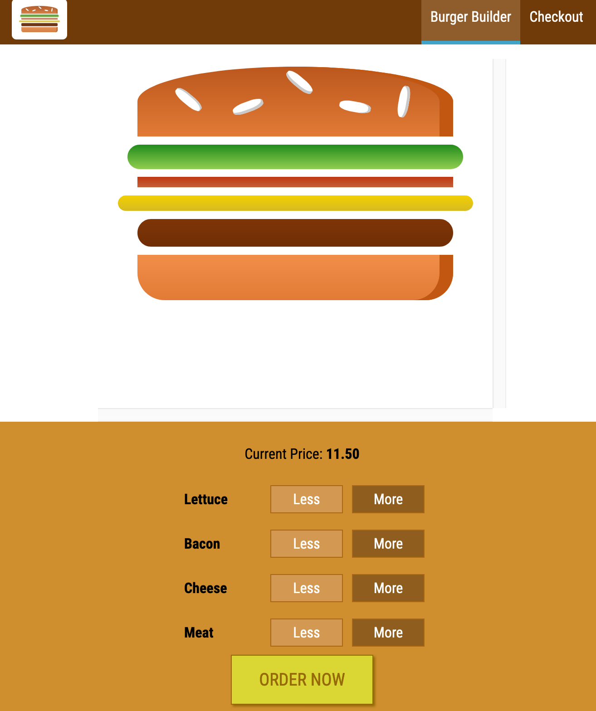
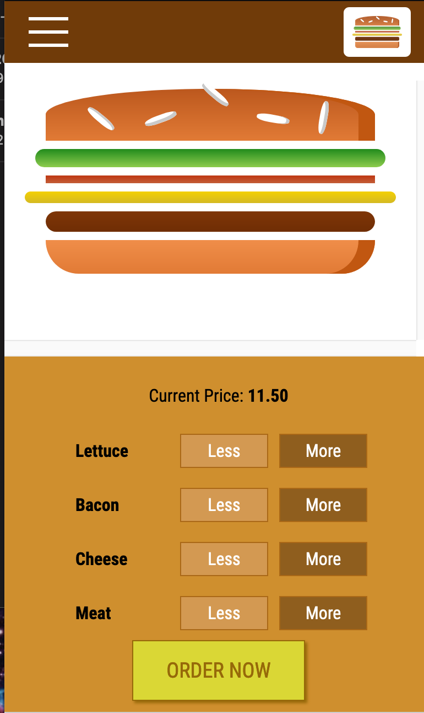

<h1>MyBurgerBuilder</h1>
<h2>This app is built using React.JS.</h2>
<ul>
  <li>Uses React to build a burger with a number of toppings such as lettuce, cheese or bacon.</li>
  <li>this app is still under construction. </li>
 </ul>
 
 
 Check out MyBurgerBulder in action! 

  
  
  
 MyBurgerBuilder also has a design for smaller screens. 

   
